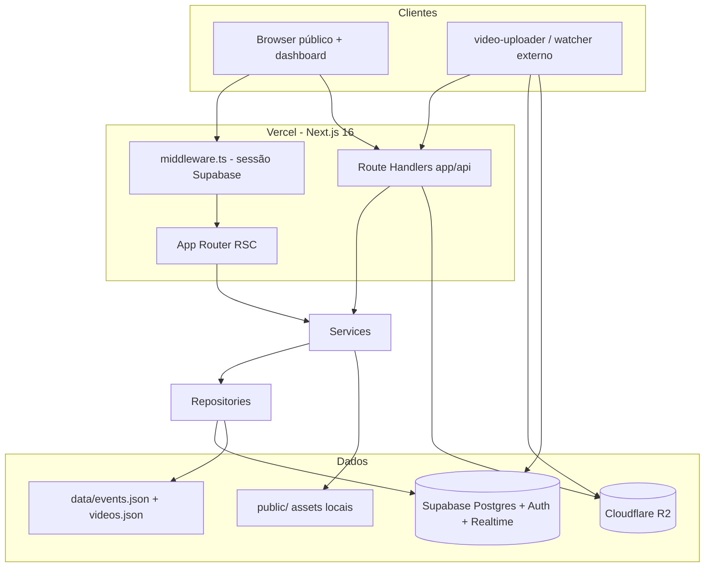
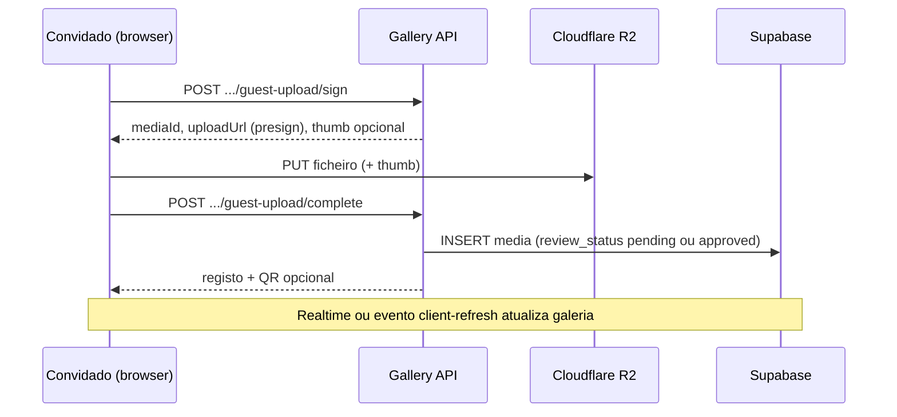

# PROJECT_CONTEXT — Gallery (MidiaUp / event-media-gallery)

Documento de contexto para continuidade de desenvolvimento, onboarding e assistentes de IA.  
**Stack verificada:** Next.js 16.2.4, React 19.2.4, TypeScript 5, Tailwind 4, `@supabase/supabase-js` 2.105.x, `@aws-sdk/client-s3` 3.104.x (R2).

> **Nota:** `docs/RELATORIO_TECNICO_HANDOFF.md` está parcialmente desatualizado (ainda descreve “sem auth” e `/admin` público). Este arquivo reflete o **estado atual do repositório**.

---

## Objetivo do projeto

Plataforma **galeria pública de mídias** (vídeo, imagem, GIF) vinculadas a **eventos**. Cada evento possui slug, nome, capa, contadores e um **token opaco de upload** (`uploadToken`) para integrações externas (watcher / video-uploader).

O produto cobre:

- **Experiência pública:** visitantes abrem `/evento/[slug]`, veem a galeria ao vivo (Realtime), curtem, compartilham, fazem upload como convidado, usam cabine virtual e momentos ao vivo.
- **Painel do cliente:** `/dashboard` autenticado para criar/gerir eventos, moderar uploads, configurar interações e métricas.
- **Admin da plataforma:** `/admin` restrito a `master_admin` (utilizadores, visão global).
- **Integração operacional:** APIs para validar credenciais do watcher, sessão Supabase para apps desktop e CRUD de eventos via Bearer token.

Persistência **híbrida**: Supabase (PostgreSQL) quando configurado, com **fallback** para JSON em `data/` em desenvolvimento local; na **Vercel** apenas Supabase grava de forma confiável.

---

## Arquitetura completa



### Camadas

| Camada | Localização | Responsabilidade |
|--------|-------------|------------------|
| Apresentação | `app/`, `components/` | Rotas públicas, dashboard, admin; UI pública e operador |
| Orquestração | `services/` | Eventos, mídia, tokens, storage JSON, exclusão em cascata |
| Persistência | `repositories/` | Adapters Supabase ↔ tipos legado (`GalleryEventRecord`, `GalleryMediaRecord`) |
| Domínio / libs | `lib/` | Auth, Supabase, R2, guest-upload, watcher, gallery, virtual-booth, analytics |
| API edge | `app/api/` | Upload guest, moderação, watcher, engagement, admin users |
| Infra config | `lib/supabase/config.ts`, `lib/r2/*`, `middleware.ts` | Env, dual-write, detecção Vercel |

### Fluxo principal ponta a ponta

1. Operador autentica-se → `/dashboard` → cria evento → recebe `eventId` + `uploadToken`.
2. Watcher externo valida credenciais (`POST /api/watcher/validate`) ou usa sessão Bearer (`/api/watcher/events`).
3. Watcher envia ficheiros para R2 e regista linha em `media` (Supabase) — pipeline no repositório **video-uploader**, não neste repo.
4. Visitante abre `/evento/[slug]` → galeria server-rendered + **Realtime** (INSERT em `media`).
5. Convidado pode enviar via **guest upload** (presign R2) → opcionalmente **moderação** antes de aparecer na galeria pública.
6. Exclusões orquestram JSON (se ativo), Supabase, R2 e ficheiros em `public/`.

---

## Estrutura de pastas

```
gallery/
├── app/
│   ├── layout.tsx, globals.css
│   ├── (public)/          # /, /login, /evento/[slug], /video/[id], /videos/[slug]
│   ├── (dashboard)/       # /dashboard, /dashboard/events/[id]
│   ├── (admin)/           # /admin, /admin/users, /admin/users/[id]
│   ├── api/               # Route Handlers (26 rotas — ver índice abaixo)
│   ├── data/videos.ts     # legado/auxiliar
│   └── test-env/          # diagnóstico de env (dev)
├── components/
│   ├── public/            # galeria, player, cabine, live moments, guest upload
│   ├── dashboard/         # gestão de evento, moderação, formulários
│   ├── admin/             # shell admin, utilizadores
│   └── ui/                # shadcn/radix (tabs, card, progress…)
├── lib/
│   ├── auth/              # sessão, dashboard-access, admin master
│   ├── supabase/          # client, server, auth-server, config
│   ├── r2/                # upload (presign), removal
│   ├── guest-upload/      # validação, cliente de upload
│   ├── watcher/           # contrato, auth Bearer, snippet credenciais
│   ├── gallery/           # layout premium/social, refresh client
│   ├── virtual-booth/     # cabine virtual (câmera, boomerang, vídeo)
│   ├── live-moments/      # momentos ao vivo
│   ├── likes/, share/, analytics/, security/, media/, admin/, dashboard/
├── services/              # eventService, mediaService, tokenService, storageService, eventDeletionService
├── repositories/          # eventRepository, mediaRepository
├── supabase/
│   ├── schema.sql
│   ├── migrations/        # 15 migrations versionadas
│   ├── README.md, MIGRATION_CHECKLIST.md
├── types/                 # event, media, video, deletion
├── utils/                 # slug, tokens, inferência de mídia
├── data/                  # events.json, videos.json (runtime local, gitignored em uso)
├── public/                # estáticos; guest-uploads/ em dev sem R2
├── docs/                  # RELATORIO_TECNICO_HANDOFF.md (referência histórica)
├── hooks/                 # placeholder
├── middleware.ts
├── next.config.ts
└── package.json
```

### Índice de APIs (`app/api/`)

| Área | Rotas |
|------|--------|
| Eventos | `POST /api/events`, `DELETE /api/events/[eventId]`, configs (likes, live-moments, virtual-booth, interactions) |
| Mídia | `PATCH/DELETE /api/media/[id]`, `download`, `like`, `view`, `track-download`, `track-share`, `public-delete`, `moderation-preview` |
| Guest upload | `guest-upload/sign`, `complete`, `guest-upload` (multipart fallback), `guest-uploads/[eventId]/[fileName]` (dev) |
| Público por slug | `events/by-slug/[slug]/gallery-media`, `view` |
| Watcher | `watcher/validate`, `watcher/session`, `watcher/events` |
| Admin | `admin/users/create` |
| Legado | `DELETE /api/videos/[id]` |

---

## Funcionalidades implementadas

### Público

- Landing marketing em `/` (MidiaUp).
- Galeria por evento `/evento/[slug]` com layouts **premium** e **social**.
- Realtime Supabase na galeria (INSERT em `media`, filtro por evento).
- Página de mídia `/video/[id]`: player, download (blob/proxy), QR, curtidas, partilha.
- **Guest upload** com presign R2 (ou fallback local em dev).
- **Moderação** de uploads guest (pending → approved/rejected).
- **Cabine virtual:** foto, boomerang, GIF, vídeo, moldura PNG no R2, import da galeria do dispositivo.
- **Live Moments** (entrada configurável na galeria).
- Curtidas anónimas (`media_likes` + `visitor_key`).
- Partilha de mídia (quando `allowMediaShare`).
- Soft-delete público opcional com PIN (`allowPublicDelete`, `requireDeletePin`).
- Métricas de engagement: views da galeria, views/download/share por mídia (sessões deduplicadas).

### Dashboard (`/dashboard`)

- Autenticação Supabase (email/senha).
- Listagem de eventos do utilizador (`owner_user_id`).
- Gestão de evento: media manager, QR, credenciais watcher, formulários de galeria/cabine/live moments/likes.
- Fila de **uploads pendentes** com Realtime e preview autenticado.
- Flags: ocultar, favorito, soft-delete, ordem manual.

### Admin (`/admin`)

- Acesso apenas `profiles.role = master_admin` e `status = active`.
- Dashboard de eventos da plataforma.
- Gestão de utilizadores: listagem, detalhe, criação via API (`POST /api/admin/users/create`).

### Backend / integrações

- Validação watcher por token (timing-safe).
- Sessão watcher: login/refresh Supabase para apps desktop.
- CRUD de eventos autenticado via Bearer (`GET/POST /api/watcher/events`).
- Persistência híbrida Supabase + JSON (dual-write opcional).
- Remoção R2 best-effort + limpeza local em `public/`.
- Exclusão de evento em cascata (`eventDeletionService`).

---

## Funcionalidades pendentes

| Item | Origem / notas |
|------|----------------|
| RBAC fino em runtime | `lib/permissions.ts` e `lib/auth/types.ts` são contratos futuros; não ligados às APIs |
| Pipeline upload operador no repo | Upload oficial do watcher continua no **video-uploader** (irmão) |
| Export Google Drive, billing, multi-tenant | Roadmap em `docs/RELATORIO_TECNICO_HANDOFF.md` (Fases 2–4) |
| Rate limiting nas APIs públicas | validate, guest sign, tracking — não implementado |
| `.env.example` versionado | Variáveis documentadas em `supabase/README.md` e secção abaixo |
| README do produto | README raiz ainda é template create-next-app |
| `components/admin/admin-events-dashboard.tsx` | Legado; substituído pelo dashboard autenticado |
| `hooks/` | Vazio |
| Middleware Next 16 → `proxy` | Aviso de depreciação na build |
| Revisão RLS tabelas de sessões engagement | Migration `20260601120000`; validar políticas no Dashboard Supabase |
| Eventos legado sem `owner_user_id` | Qualquer autenticado pode mutar (Fase 1 intencional) |

---

## Fluxo de autenticação

```mermaid
sequenceDiagram
  participant U as Utilizador
  participant MW as middleware.ts
  participant SB as Supabase Auth
  participant App as App / API

  U->>App: GET /dashboard ou /admin
  App->>MW: request + cookies
  MW->>SB: getUser() + refresh cookies
  alt sem NEXT_PUBLIC_SUPABASE_*
    MW-->>U: redirect /login?error=config
  else sem user em rota protegida
    MW-->>U: redirect /login?next=...
  else user em /login
    MW-->>U: redirect /dashboard ou next
  end
  U->>App: POST login (login-form.tsx)
  App->>SB: signInWithPassword
  SB-->>App: sessão em cookies
```



### Componentes

| Ficheiro | Função |
|----------|--------|
| `middleware.ts` | Refresh de sessão; protege `/dashboard` e `/admin`; redireciona login |
| `app/(public)/login/login-form.tsx` | `signInWithPassword` via browser client |
| `lib/supabase/auth-server.ts` | Cliente server com cookies (RSC/handlers) |
| `lib/auth/session.ts` | `requireSessionUser()` em layouts dashboard |
| `lib/auth/admin.ts` | `getMasterAdminAccess()` — role `master_admin` em `profiles` |
| `lib/watcher/auth.ts` | Bearer token para APIs watcher autenticadas |

### Papéis

- **`profiles.role`:** `master_admin`, `customer`, `operator` (`lib/auth/profile-options.ts`).
- **`profiles.status`:** `active`, `suspended` — bloqueia login e APIs watcher.
- **Dono de evento:** `events.owner_user_id` — mutações no dashboard; legado sem dono = qualquer autenticado (`lib/auth/dashboard-access.ts`).

### Rotas protegidas vs públicas

| Rota | Proteção |
|------|----------|
| `/dashboard`, `/dashboard/events/*` | Login obrigatório (middleware) |
| `/admin`, `/admin/users/*` | Login + `master_admin` no layout |
| `/login` | Público; redireciona se já autenticado |
| `/`, `/evento/*`, `/video/*` | Público |
| APIs dashboard/admin | `getRouteHandlerUser()` / ownership checks |
| `POST /api/watcher/validate` | **Sem auth** (apenas eventId + uploadToken) |

---

## Integração com Supabase

### Clientes

| Módulo | Uso |
|--------|-----|
| `lib/supabase/config.ts` | URL/anon runtime, dual-write, `isVercelDeployment()`, `shouldPersistLegacyJsonFiles()` |
| `lib/supabase/client.ts` | Browser — Realtime, login; retorna `null` se env ausente |
| `lib/supabase/auth-server.ts` | Server com cookies (`@supabase/ssr`) |
| `lib/supabase/server.ts` | Service role para writes administrativos |

### Tabelas principais (`supabase/schema.sql` + migrations)

| Tabela | Papel |
|--------|-------|
| `events` | Evento, slug, `upload_token`, flags (guest upload, delete público, cabine, live moments, likes, share, layout, engagement…) |
| `media` | Mídia do evento, URLs, `review_status`, `media_source`, soft-delete, likes, engagement |
| `media_likes` | Curtida por `(media_id, visitor_key)` |
| `profiles` | Perfil ligado a `auth.users` (role, status, nome) |
| `event_gallery_view_sessions` | Dedup de views da galeria |
| `media_view_sessions` | Dedup de views por mídia |

### Migrations (ordem)

1. `20260505120000_phase1_owner_user_rls.sql`
2. `20260521000000_phase1_master_admin_profiles.sql`
3. `20260521010000_phase2_dashboard_media_flags.sql`
4. `20260522090000_public_media_delete_settings.sql`
5. `20260522130500_guest_public_uploads.sql`
6. `20260524183600_guest_upload_review_moderation.sql`
7. `20260525002900_dashboard_pending_media_realtime_select.sql`
8. `20260525120000_event_pocket_booth_frame_url.sql`
9. `20260525140000_event_gallery_layout.sql`
10. `20260529120000_event_cabine_virtual_config.sql`
11. `20260529140000_event_cabine_virtual_sources.sql`
12. `20260529160000_event_live_moments.sql`
13. `20260530120000_media_likes.sql`
14. `20260531120000_event_allow_media_share.sql`
15. `20260601120000_event_engagement_metrics.sql`

### RLS (resumo)

- Leitura pública de eventos; mídia pública apenas `review_status = 'approved'` e não oculta/apagada.
- Mutação de eventos/mídia por `owner_user_id` (e políticas para pendentes no dashboard).
- Service role no servidor para operações confiáveis quando RLS é restritiva.

### Realtime

- **Galeria:** canal `gallery_media:{slug}:{eventId}` — `postgres_changes` INSERT em `media`.
- **Moderação:** canal `dashboard_pending_guest_uploads:{eventId}` em `pending-guest-uploads.tsx`.
- Requisito: publicação Realtime na tabela `media` no projeto Supabase.

### Variáveis Supabase

```
NEXT_PUBLIC_SUPABASE_URL
NEXT_PUBLIC_SUPABASE_ANON_KEY
SUPABASE_URL              # espelho servidor (Vercel)
SUPABASE_ANON_KEY         # espelho servidor
SUPABASE_SERVICE_ROLE_KEY # somente servidor — nunca no browser
GALLERY_DUAL_WRITE_LEGACY_JSON  # opcional: espelhar em data/*.json
```

---

## Integração com Cloudflare R2

Cliente **S3-compatível** (`@aws-sdk/client-s3` + presigner).

### Variáveis

```
R2_ACCOUNT_ID
R2_ACCESS_KEY_ID
R2_SECRET_ACCESS_KEY
R2_BUCKET_NAME
R2_REGION              # default: auto
R2_KEY_PREFIX          # default: videos
R2_PUBLIC_BASE_URL     # URL pública do bucket (ou aliases R2_PUBLIC_URL, NEXT_PUBLIC_R2_*)
```

### Operações

| Operação | Módulo | Detalhe |
|----------|--------|---------|
| Presign PUT guest | `lib/r2/upload.ts` | Chave `{prefix}/guest/{eventId}/{mediaId}.{ext}`, TTL ~300s |
| Upload server-side | `storeGuestUploadObject` | Fallback multipart quando presign indisponível |
| Moldura cabine | `buildVirtualBoothFrameKey` | `{prefix}/frames/{eventId}.png` |
| Remoção | `lib/r2/removal.ts` | Prefixo por mídia `{prefix}/{mediaId}/`; thumbnails/qrcodes fixos |
| Dev sem R2 | `public/guest-uploads/` | Servido por `app/api/guest-uploads/[eventId]/[fileName]/route.ts` |

URLs finais de mídia vêm das colunas `url` / `thumbnail_url` em `media` (domínio público R2 configurado fora do app). Guest upload exige **CORS** no bucket para PUT do browser.

O **watcher/video-uploader** faz upload operador diretamente para R2; este app não expõe rota multipart para o pipeline oficial.

---

## Integração com Vercel

- **Sem `vercel.json`** — deploy padrão Next.js.
- **Build:** `npm run build` (Turbopack; `next.config.ts` define `turbopack.root`).
- **Runtime:** Route Handlers Node para operações com FS/R2/service role; `dynamic = "force-dynamic"` em páginas de galeria/dashboard.
- **Detecção:** `VERCEL=1` em `lib/supabase/config.ts` — desativa escrita em `data/*.json`.
- **URLs absolutas:** `NEXT_PUBLIC_SITE_URL` ou fallback `https://${VERCEL_URL}` em `lib/media/publicPageUrl.ts` (QR, links).
- **Env críticas na Vercel:** `NEXT_PUBLIC_SUPABASE_*`, `SUPABASE_SERVICE_ROLE_KEY`, `R2_*`, `R2_PUBLIC_BASE_URL`.

---

## Como funciona o Watcher

O **daemon watcher** (pastas monitoradas, FFmpeg, upload R2, insert em `media`) vive no repositório **video-uploader**, não aqui. Este projeto expõe a **API de galeria** que o watcher consome.

### 1. Validação por token (sem login)

```
POST /api/watcher/validate
Body: { eventId, uploadToken }
→ tokenService.validateWatcherCredentials (comparação timing-safe)
```

Usado antes de enviar ficheiros; **endpoint público** — mitigação: token opaco longo, comparação timing-safe.

### 2. Sessão Supabase (apps desktop)

```
POST /api/watcher/session     # email + password → tokens
PATCH /api/watcher/session    # refreshToken
```

Verifica suspensão em `profiles`. Retorna access/refresh tokens para chamadas subsequentes.

### 3. Eventos autenticados (Bearer)

```
GET  /api/watcher/events      # lista eventos do owner_user_id
POST /api/watcher/events      # cria evento (name)
```

Auth: header `Authorization: Bearer <access_token>` → `lib/watcher/auth.ts` → `supabase.auth.getUser`.

### 4. Credenciais para configurar o watcher

No dashboard, snippet formatado (`lib/watcher/format-credentials.ts`):

```
EVENT_ID=...
UPLOAD_TOKEN=...
```

Contrato tipado em `lib/watcher/contract.ts` (`WatcherGalleryBinding`, `WatcherCredentialsPayload`).

### Sincronização com a galeria

1. Watcher valida → upload R2 → INSERT `media` no Supabase.  
2. Browser na `/evento/[slug]` recebe INSERT via Realtime ou refresh manual (`lib/gallery/client-refresh.ts`).

---

## Como funciona o upload público (guest)

Pré-requisito: `events.allow_guest_upload = true`.



### Ficheiros-chave

- UI: `components/public/guest-upload-button.tsx`
- Cliente: `lib/guest-upload/upload-client.ts` (XHR PUT, CORS, progresso)
- Validação: `lib/guest-upload/validation.ts` (JPEG/PNG/WebP/GIF, MP4/WebM/MOV; máx. 100 MB; thumb 3 MB)
- Rotas: `guest-upload/sign`, `guest-upload/complete`
- Fallback: `POST .../guest-upload` (FormData, upload server-side)

### Visibilidade

- Com `require_guest_upload_approval`: `review_status = pending` até aprovação.
- Galeria pública só mostra `review_status = approved` (`isMediaVisiblePublicly` + RLS).

---

## Como funciona a moderação

1. Operador ativa **“exigir aprovação”** no dashboard (`requireGuestUploadApproval`).
2. Upload guest completa com `reviewStatus: "pending"`.
3. Dashboard: `components/dashboard/pending-guest-uploads.tsx`
   - Realtime em uploads pendentes do evento.
   - Preview: `GET /api/media/[id]/moderation-preview` (proxy autenticado da URL).
4. Aprovar/rejeitar: `PATCH /api/media/[id]` com `{ reviewStatus: "approved" | "rejected" }` (`lib/dashboard/media-actions.ts`).
5. Gestão geral também em `event-media-manager.tsx` (badges Pendente/Rejeitada).

Política RLS (`20260525002900`): dono vê pendentes; anónimo só vê `approved`.

---

## Como funciona a Gallery

### Server (`app/(public)/evento/[slug]/page.tsx`)

1. `getEventBySlug(slug)` → configurações públicas (cabine, live moments, likes, share).
2. `getEventVideosForEventSlug` → mídia filtrada (`approved`, não oculta, não soft-deleted).
3. Renderiza `VideoGallery` com `initialVideos` e flags do evento.

### Client (`components/public/video-gallery.tsx`)

- Layouts **premium** (`PremiumGalleryGrid`) ou **social** (`SocialGalleryGrid`) via `galleryLayout`.
- Realtime: subscrição INSERT em `media`; normalização de payload; dedupe por `id`; glow em itens novos.
- Integrações na mesma página: `GuestUploadButton`, `VirtualBoothLauncher`, `LiveMomentsEntry`.
- Evento custom `GALLERY_MEDIA_PUBLISHED_EVENT` para refresh após guest upload/cabine.
- Preferência mobile 2 colunas em `localStorage` (`gallery-mobile-two-cols`).

### Página de mídia (`/video/[id]`)

Player, download, QR, like, share, delete público (se configurado). Tracking via APIs `view`, `track-download`, `track-share`.

### Engagement

- `EventGalleryViewTracker` → `POST /api/events/by-slug/[slug]/view`
- Métricas agregadas em `events` e `media` (migration `20260601120000`)

---

## Decisões arquiteturais importantes

1. **Next.js 16 App Router** com RSC + islands client; páginas de galeria `force-dynamic` + `connection()` para dados frescos.
2. **Persistência híbrida** durante migração JSON → Postgres; na Vercel só Supabase persiste de forma suportada.
3. **Service role no servidor** para writes confiáveis; browser usa anon + RLS para leitura/Realtime.
4. **Upload pesado fora do Next:** presign R2 no browser (guest); operador via app externo (watcher).
5. **Separação de painéis:** `/dashboard` (cliente/evento) vs `/admin` (plataforma `master_admin`).
6. **Realtime apenas no cliente** — servidor não mantém WebSockets.
7. **Identificação anónima:** `visitor_key` em storage para likes/views (sem login público).
8. **Rotas centralizadas** em `lib/routes.ts` (facilita Electron/deep links futuros).
9. **Camada services → repositories** — UI não acopla ao storage concreto.
10. **Comparação timing-safe** de `uploadToken` (`tokenService.compareUploadTokens`).
11. **Visibilidade pública única:** `review_status === 'approved'` + não hidden + não deleted.

---

## Problemas conhecidos

| Problema | Impacto |
|----------|---------|
| `POST /api/watcher/validate` sem auth | Possível brute-force de token (mitigado por token longo + timing-safe) |
| Eventos sem `owner_user_id` | Qualquer utilizador autenticado pode mutar no dashboard |
| `lib/permissions.ts` não aplicada | RBAC fino ausente no runtime |
| Dual-write JSON + Supabase | Edge cases de ordem de leitura; só relevante em dev/migração |
| Guest upload depende de CORS R2 + `R2_PUBLIC_BASE_URL` | Falhas de rede/CORS com mensagens no client |
| Realtime silencioso se env browser ausente | `createBrowserSupabase()` retorna `null` |
| Logs verbosos `[REALTIME]`, `[MODERATION_REALTIME]` | Ruído e possível vazamento de estrutura em produção |
| Exclusão R2 desalinhada do uploader | Lixo residual no bucket |
| Sem rate limit em APIs públicas | validate, guest sign, tracking |
| Handoff desatualizado | Pode induzir erros de segurança (“admin público”) |
| Middleware Next 16 deprecado | Migração futura para `proxy` |
| Sem `.env.example` no repo | Onboarding depende de docs dispersas |
| `admin-events-dashboard.tsx` | Código legado não ligado a rotas |

---

## Próximos passos recomendados

### Prioridade alta

1. **Rate limiting** em `/api/watcher/validate`, guest-upload sign e endpoints de tracking.
2. **Migrar eventos legado** para `owner_user_id` e restringir mutação no dashboard.
3. **Revisar RLS** das tabelas de sessões de engagement no Supabase Dashboard.
4. **Adicionar `.env.example`** com todas as variáveis documentadas.
5. **Atualizar ou arquivar** `docs/RELATORIO_TECNICO_HANDOFF.md` para não contradizer este contexto.

### Prioridade média

6. Integrar `lib/permissions.ts` a claims reais (JWT custom ou tabela de permissões).
7. Reduzir logs de diagnóstico em produção (flag `DEBUG_GALLERY`).
8. Documentar operação do **video-uploader** no mesmo ecossistema (paths R2, insert `media`).
9. Substituir middleware por `proxy` quando estável no Next 16.
10. Remover ou consolidar componentes legado (`admin-events-dashboard.tsx`).

### Roadmap produto (handoff)

- Fase 2: dashboard contratante, export Google Drive, analytics avançado.
- Fase 3: multiempresa, billing, white-label.
- Fase 4: observabilidade (Sentry), backup DR Postgres, políticas RLS de produção revisadas.

---

## Variáveis de ambiente (referência rápida)

| Variável | Escopo | Papel |
|----------|--------|-------|
| `NEXT_PUBLIC_SUPABASE_URL` | Client + server | URL Supabase |
| `NEXT_PUBLIC_SUPABASE_ANON_KEY` | Client + server | Chave anon (login, Realtime) |
| `SUPABASE_URL`, `SUPABASE_ANON_KEY` | Server | Espelho Vercel runtime |
| `SUPABASE_SERVICE_ROLE_KEY` | Server only | Writes administrativos |
| `GALLERY_DUAL_WRITE_LEGACY_JSON` | Server | Espelhar `data/*.json` |
| `NEXT_PUBLIC_SITE_URL`, `VERCEL_URL` | Build/runtime | URLs absolutas |
| `R2_*`, `R2_PUBLIC_BASE_URL` | Server (+ presign client) | Storage objeto |
| `VERCEL` | Auto | Detecção deploy |

**Nunca expor** `SUPABASE_SERVICE_ROLE_KEY` nem segredos R2 no client.

---

## Documentos relacionados

- `supabase/README.md` — setup Supabase
- `supabase/MIGRATION_CHECKLIST.md` — checklist de migração e segurança
- `docs/RELATORIO_TECNICO_HANDOFF.md` — relatório histórico (parcialmente desatualizado)
- `AGENTS.md` — regras Next.js 16 para agentes

---

*Gerado a partir da análise estática do repositório `gallery`. Atualizar quando migrations, auth ou APIs mudarem.*
