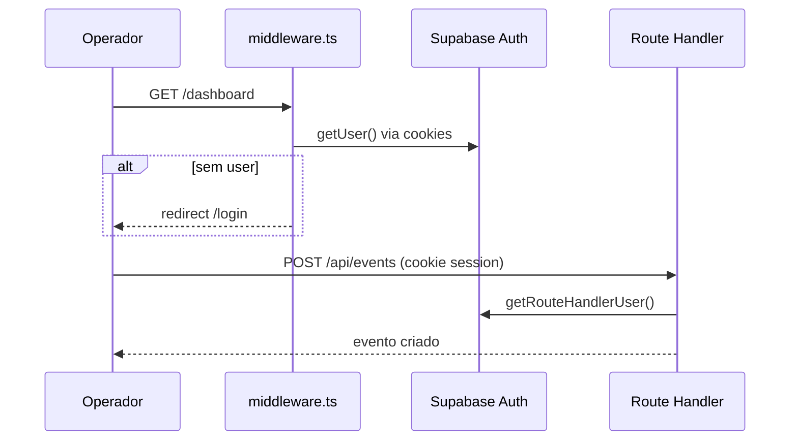
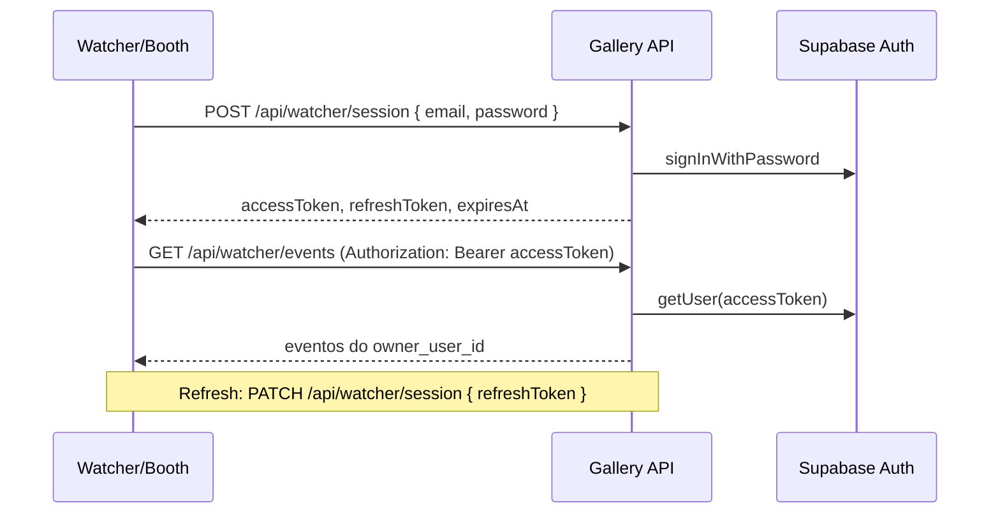
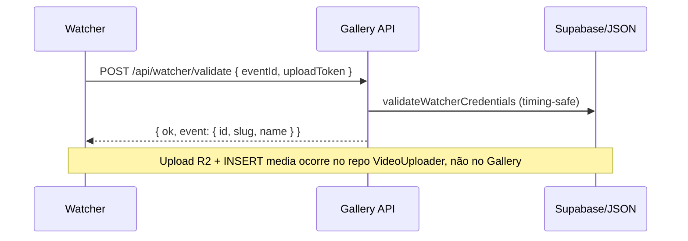
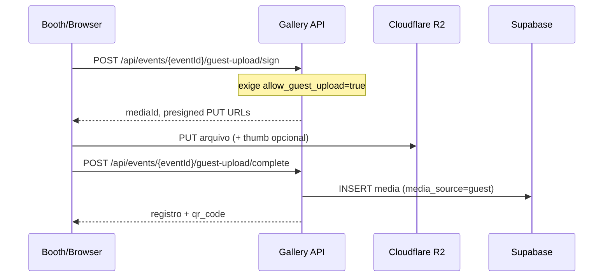
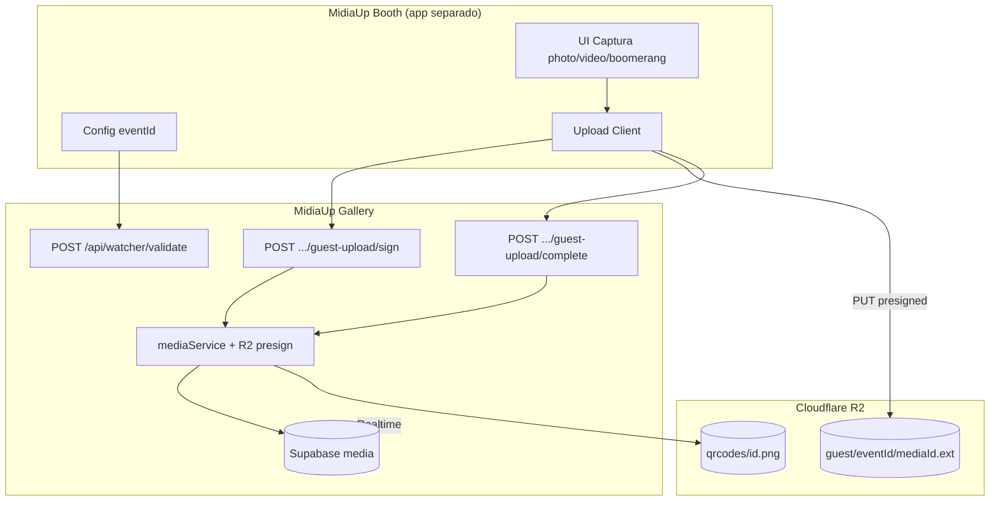

# FASE 2.0A — Gallery Connectivity Audit

**Data:** 2026-06-10  
**Repositório analisado:** MidiaUp Gallery (`event-media-gallery-1.0`)  
**Escopo:** auditoria arquitetural para integração futura do **MidiaUp Booth** com o **MidiaUp Gallery**  
**Restrições respeitadas:** nenhuma alteração de código, banco, migrations ou APIs.

---

## Resumo executivo

O MidiaUp Gallery é uma aplicação **Next.js 16 (App Router)** que centraliza persistência em **Supabase (Postgres)**, armazenamento de blobs em **Cloudflare R2**, e expõe **Route Handlers** em `/api/*`. A **Cabine Virtual (Booth)** já existe **embutida** na galeria pública como componentes client-side (`virtual-booth-modal.tsx`) e publica mídia pelo fluxo **guest-upload** (`sign → R2 PUT → complete`).

Para um **Booth standalone** (app separado), a integração recomendada é **conversar com a Gallery API** — reutilizando o fluxo guest-upload para publicação de mídia e, opcionalmente, as APIs watcher para gestão de eventos por operador autenticado. **Não** copiar `SUPABASE_SERVICE_ROLE_KEY` nem credenciais R2 de escrita para o Booth quando o fluxo presign estiver disponível.

O **MidiaUp Watcher (VideoUploader)** vive em repositório externo; neste projeto existem apenas os **contratos e endpoints** que o watcher consome. O watcher faz upload direto ao R2 e insert em `media` no Supabase — padrão diferente do guest-upload.

---

## 1. Variáveis de ambiente

### 1.1 Arquivos `.env` no repositório

| Arquivo | Status no repositório |
|---------|----------------------|
| `.env` | **Não versionado** (ausente no workspace; tipicamente gitignored) |
| `.env.local` | **Não versionado** |
| `.env.production` | **Não versionado** |
| `.env.example` | **Não existe** no repositório |

Documentação de referência encontrada em:

- `supabase/README.md`
- `PROJECT_CONTEXT.md`
- `supabase/MIGRATION_CHECKLIST.md`

### 1.2 Tabela completa de variáveis (código + docs)

| Variável | Utilizada por | Finalidade | Necessária para Booth? |
| -------- | ------------- | ---------- | ---------------------- |
| `NEXT_PUBLIC_SUPABASE_URL` | Browser, middleware, watcher auth, Realtime | URL do projeto Supabase | **Opcional** — só se o Booth usar login watcher (Bearer via Supabase) diretamente no client |
| `NEXT_PUBLIC_SUPABASE_ANON_KEY` | Browser, middleware, watcher auth | Chave anon pública Supabase | **Opcional** — mesmo caso acima |
| `SUPABASE_URL` | Servidor (fallback runtime Vercel) | Espelho servidor da URL Supabase | **Não** — Booth não deve rodar lógica servidor do Gallery |
| `SUPABASE_ANON_KEY` | Servidor (fallback runtime) | Espelho servidor da anon key | **Não** |
| `SUPABASE_SERVICE_ROLE_KEY` | `lib/supabase/server.ts`, repositórios, Route Handlers | Bypass RLS; writes confiáveis no Postgres | **Nunca** — permanece exclusiva do Gallery |
| `GALLERY_DUAL_WRITE_LEGACY_JSON` | `lib/supabase/config.ts` | Espelha writes em `data/*.json` durante migração | **Não** |
| `VERCEL` | `lib/supabase/config.ts` | Detecta deploy Vercel; desativa escrita local JSON | **Não** (infra Gallery) |
| `VERCEL_URL` | `lib/media/publicPageUrl.ts` | Fallback de URL absoluta (QR, links) | **Não** — Booth usa URL base do Gallery configurada |
| `NEXT_PUBLIC_SITE_URL` | `lib/media/publicPageUrl.ts` | URL pública canônica do site | **Recomendada no Booth** como `GALLERY_BASE_URL` (nome no Booth; não existe no Gallery hoje) |
| `R2_ACCOUNT_ID` | `lib/r2/upload.ts`, `lib/r2/removal.ts` | Conta Cloudflare R2 | **Não** — se Booth usar presign do Gallery |
| `R2_ACCESS_KEY_ID` | R2 upload/removal | Credencial S3-compatível | **Não** — idem |
| `R2_SECRET_ACCESS_KEY` | R2 upload/removal | Credencial secreta R2 | **Nunca no Booth** se Gallery presignar |
| `R2_BUCKET_NAME` | R2 upload/removal | Nome do bucket | **Não** |
| `R2_REGION` | R2 upload/removal | Região (default `auto`) | **Não** |
| `R2_KEY_PREFIX` | R2 upload/removal | Prefixo de chaves (default `videos`) | **Não** |
| `R2_PUBLIC_BASE_URL` | `lib/r2/upload.ts` | URL pública do bucket | **Não** no Booth (URLs vêm do `complete`) |
| `R2_PUBLIC_URL` | Alias de `R2_PUBLIC_BASE_URL` | Idem | **Não** |
| `R2_BUCKET_PUBLIC_URL` | Alias de `R2_PUBLIC_BASE_URL` | Idem | **Não** |
| `NEXT_PUBLIC_R2_PUBLIC_BASE_URL` | Alias público | Idem | **Não** |
| `NEXT_PUBLIC_R2_PUBLIC_URL` | Alias público | Idem | **Não** |

### 1.3 Variáveis que o Booth precisará definir (fora do Gallery)

| Variável sugerida (Booth) | Finalidade |
|---------------------------|------------|
| `GALLERY_API_BASE_URL` | Base URL do Gallery deployado (ex.: `https://gallery.midiaup.com`) |
| `BOOTH_EVENT_ID` | ID do evento vinculado na cabine física |
| `BOOTH_UPLOAD_TOKEN` | Token opaco do evento (modo watcher/operador) — **opcional** conforme fluxo |
| Credenciais operador | E-mail/senha Supabase — **opcional**, só para fluxo watcher autenticado |

---

## 2. Autenticação

### 2.1 Mecanismos existentes no Gallery

| Mecanismo | Existe? | Onde | Uso |
|-----------|---------|------|-----|
| **Supabase Auth** | Sim | `middleware.ts`, `lib/supabase/auth-server.ts`, login | Dashboard `/dashboard`, Admin `/admin` |
| **JWT (sessão Supabase)** | Sim | Cookies HTTP + Bearer em APIs watcher | Sessão browser; apps desktop via `/api/watcher/session` |
| **Upload Token** | Sim | `events.upload_token` | Validação watcher sem login (`POST /api/watcher/validate`) |
| **API Key dedicada** | Não | — | Não há API key estática para Booth |
| **Sessão browser** | Sim | Cookies Supabase SSR | Protege dashboard |
| **Watcher Login** | Sim | `POST /api/watcher/session` | E-mail + senha → `accessToken` / `refreshToken` |

### 2.2 Fluxo — Dashboard (operador web)



**Componentes:** `middleware.ts`, `lib/auth/session.ts` (`getRouteHandlerUser`), `lib/auth/dashboard-access.ts` (`assertUserCanMutateEvent`).

### 2.3 Fluxo — Watcher / app desktop autenticado



### 2.4 Fluxo — Watcher / upload por token (sem login)



### 2.5 Fluxo — Guest / Cabine (sem login)



**Sem autenticação de usuário.** Proteção: flag `allow_guest_upload` no evento + validação MIME/tamanho + presign TTL (~300s).

### 2.6 Papéis e autorização

| Papel | Fonte | Efeito |
|-------|-------|--------|
| `master_admin` | `profiles.role` | Acesso `/admin` |
| `customer` / `operator` | `profiles.role` | Dashboard |
| Dono do evento | `events.owner_user_id` | Mutação de evento/mídia |
| Legado sem dono | `owner_user_id` ausente | Qualquer autenticado pode mutar (Fase 1) |
| Suspenso | `profiles.status` | Bloqueia login e APIs watcher |

---

## 3. Eventos

### 3.1 Tabela `public.events`

Definida em `supabase/schema.sql`. Campos principais:

| Coluna DB | Tipo | Descrição |
|-----------|------|-----------|
| `id` | text PK | Identificador estável (slug-like) |
| `slug` | text unique | URL pública `/evento/{slug}` |
| `name` | text | Nome exibido |
| `upload_token` | text | Token opaco para watcher/booth operador |
| `created_at` | timestamptz | Criação |
| `cover_image` | text | URL capa |
| `videos_count` | integer | Contador de mídias (nome legado; conta **todos** os tipos) |
| `owner_user_id` | uuid FK | Dono Supabase Auth |
| `allow_public_delete` | boolean | Soft-delete público |
| `require_delete_pin` | boolean | PIN para delete público |
| `delete_pin_hash` | text | Hash do PIN (nunca expor ao público) |
| `allow_guest_upload` | boolean | Habilita guest-upload / cabine publicação |
| `require_guest_upload_approval` | boolean | Mídia guest fica `pending` |
| `frame_url` | text | Moldura PNG da cabine |
| `gallery_layout` | text | `premium` \| `social` |
| `cabine_virtual_*` | boolean/int | Flags da cabine (photo, boomerang, video, duração…) |
| `live_moments_enabled` | boolean | Momentos ao vivo |
| `allow_likes` | boolean | Curtidas públicas |
| `allow_media_share` | boolean | Compartilhamento |
| `view_count`, `download_count`, `share_count` | integer | Métricas |

Tipo TypeScript: `types/event.ts` → `GalleryEventRecord`.

### 3.2 APIs relacionadas a eventos

| Método | Endpoint | Auth | Função |
|--------|----------|------|--------|
| `POST` | `/api/events` | Supabase session (dashboard) | Criar evento |
| `PATCH` | `/api/events/[eventId]` | Session + ownership | Config galeria (delete público, guest upload, layout) |
| `DELETE` | `/api/events/[eventId]` | Session + ownership | Excluir evento e assets |
| `PATCH` | `/api/events/[eventId]/virtual-booth-config` | Session + ownership | Flags cabine virtual |
| `POST` | `/api/events/[eventId]/virtual-booth-frame` | Session + ownership | Upload moldura PNG |
| `DELETE` | `/api/events/[eventId]/virtual-booth-frame` | Session + ownership | Remover moldura |
| `PATCH` | `/api/events/[eventId]/likes-config` | Session + ownership | Curtidas |
| `PATCH` | `/api/events/[eventId]/interactions-config` | Session + ownership | Interações |
| `PATCH` | `/api/events/[eventId]/live-moments-config` | Session + ownership | Live moments |
| `GET` | `/api/events/by-slug/[slug]/gallery-media` | **Público** | Lista mídia pública do evento |
| `POST` | `/api/events/by-slug/[slug]/view` | Público | Tracking view galeria |
| `GET` | `/api/watcher/events` | Bearer JWT | Listar eventos do operador |
| `POST` | `/api/watcher/events` | Bearer JWT | Criar evento |
| `POST` | `/api/watcher/validate` | **Público** (eventId + token) | Validar credenciais watcher |

**Não existe** `GET /api/events` (listagem geral) nem `GET /api/events/[eventId]` como API REST pública.

### 3.3 Como app externa pode interagir com eventos

| Ação | Mecanismo disponível hoje |
|------|---------------------------|
| **Listar eventos** | `GET /api/watcher/events` com Bearer (apenas eventos do `owner_user_id`) |
| **Consultar evento** | Indireto: `POST /api/watcher/validate` retorna `{ id, slug, name }`; ou `GET /api/events/by-slug/{slug}/gallery-media` (precisa do slug) |
| **Vincular evento** | Configurar `EVENT_ID` + `UPLOAD_TOKEN` no Booth (padrão watcher); ou fixar `eventId` no Booth e usar guest-upload se `allow_guest_upload=true` |
| **Criar evento** | `POST /api/watcher/events` ou `POST /api/events` (ambos autenticados) |

Leitura direta do Supabase por app externa é **possível** com anon key + RLS, mas **não recomendada** para o Booth (ver seção 8).

---

## 4. Watcher

### 4.1 O que existe neste repositório

| Artefato | Caminho |
|----------|---------|
| Contrato tipado | `lib/watcher/contract.ts` |
| Auth Bearer | `lib/watcher/auth.ts` |
| Validação token | `services/tokenService.ts` |
| Snippet credenciais | `lib/watcher/format-credentials.ts` |

O **daemon** (pastas monitoradas, FFmpeg, upload R2, insert `media`) está no repositório **VideoUploader**, não aqui.

### 4.2 Como o Watcher opera (ponta a ponta lógica)

#### 1. Autenticação

**Opção A — Token por evento (sem login):**
```
POST /api/watcher/validate
Body: { "eventId": "...", "uploadToken": "..." }
```

**Opção B — Login operador:**
```
POST /api/watcher/session  → tokens
PATCH /api/watcher/session → refresh
```

#### 2. Validação de evento

- `tokenService.validateWatcherCredentials` compara `uploadToken` com `events.upload_token` usando `timingSafeEqual`.
- Códigos de erro: `EVENT_NOT_FOUND`, `TOKEN_MISSING`, `TOKEN_MISMATCH`, `TOKEN_NOT_CONFIGURED`.

#### 3. Envio de arquivos

**Não implementado neste repo.** O VideoUploader, após validar:

1. Faz upload do blob para R2 (credenciais próprias no watcher).
2. Insere linha em `public.media` no Supabase (service role ou credencial do uploader).
3. Popula: `media_type`, `file_type`, `url`, `thumbnail_url`, `qr_code`, `event_id`, `event_slug`, `media_source='operator'`.

#### 4. Confirmação

- Não há endpoint `POST /api/upload/confirm` no Gallery.
- Confirmação = sucesso do INSERT no Supabase + Realtime `postgres_changes` na galeria pública.

### 4.3 Endpoints watcher no Gallery

| Método | Endpoint | Auth | Resposta principal |
|--------|----------|------|-------------------|
| `POST` | `/api/watcher/validate` | Nenhuma | `{ ok, event? }` |
| `POST` | `/api/watcher/session` | Nenhuma (credenciais no body) | `{ ok, user, session }` |
| `PATCH` | `/api/watcher/session` | Nenhuma (refreshToken no body) | `{ ok, user, session }` |
| `GET` | `/api/watcher/events` | Bearer | `{ ok, events[] }` |
| `POST` | `/api/watcher/events` | Bearer | `{ success, event }` |

### 4.4 Binding esperado no watcher (`config.json`)

```typescript
// lib/watcher/contract.ts
{
  watchFolder: string;
  eventId: string;
  uploadToken: string;
}
```

Snippet gerado no dashboard:
```
EVENT_ID=...
UPLOAD_TOKEN=...
```

---

## 5. Upload

### 5.1 Fluxos existentes

#### Fluxo A — Guest / Cabine Virtual (implementado no Gallery)

```
Arquivo (browser/Booth)
  ↓
POST /api/events/{eventId}/guest-upload/sign
  ↓ validação MIME, tamanho, allow_guest_upload
Presigned PUT URL (TTL ~300s)
  ↓
PUT direto → Cloudflare R2  ({prefix}/guest/{eventId}/{mediaId}.{ext})
  ↓
POST /api/events/{eventId}/guest-upload/complete
  ↓ generateAndStoreMediaQrCode, appendGalleryMediaRecord
INSERT Supabase tabela media
  ↓
Realtime / client-refresh → galeria atualizada
```

**Arquivos-chave:**

| Camada | Módulo |
|--------|--------|
| Cliente | `lib/guest-upload/upload-client.ts` |
| Validação | `lib/guest-upload/validation.ts` |
| R2 presign | `lib/r2/upload.ts` |
| Persistência | `services/mediaService.ts` → `repositories/mediaRepository.ts` |
| QR | `lib/media/qr-code.ts` |
| Rotas | `guest-upload/sign`, `guest-upload/complete`, `guest-upload` (fallback FormData) |

**Validações:**

| Regra | Valor |
|-------|-------|
| Tamanho máximo | 100 MB (`MAX_GUEST_UPLOAD_BYTES`) |
| Thumbnail vídeo | máx. 3 MB; JPEG/PNG/WebP |
| MIME permitidos | JPEG, PNG, WebP, GIF, MP4, WebM, MOV |
| Pré-requisito evento | `allow_guest_upload = true` |
| Moderação | `review_status = pending` se `require_guest_upload_approval` |
| `media_source` | sempre `guest` |
| Detecção boomerang | `file_type=image/gif` + `boomerang` no filename → `media_type=boomerang` |

#### Fluxo B — Operador / Watcher (externo ao Gallery)

```
POST /api/watcher/validate
  ↓
Upload R2 (credenciais no VideoUploader)
  ↓
INSERT media Supabase (VideoUploader)
  ↓
Realtime → galeria
```

**O Gallery não expõe** rota multipart para pipeline operador.

#### Fluxo C — Fallback dev (sem R2)

```
POST /api/events/{eventId}/guest-upload (FormData)
  ↓
storeGuestUploadObject → public/guest-uploads/
  ↓
Servido por GET /api/guest-uploads/{eventId}/{fileName}
```

Desativado em Vercel (`isVercelDeployment()` exige R2).

### 5.2 O Booth pode reutilizar exatamente esse fluxo?

| Cenário Booth | Reutilizar guest-upload? | Observação |
|---------------|--------------------------|------------|
| Cabine pública no evento (convidado) | **Sim** | É o que `virtual-booth-modal.tsx` já faz via `uploadGuestMediaFile` |
| Cabine física de operador em evento | **Parcial** | Guest-upload exige `allow_guest_upload`; mídia fica `media_source=guest`. Para operador oficial, o padrão watcher é mais adequado |
| Booth com login operador | **Híbrido** | Login via `/api/watcher/session` + criação/lista de eventos; upload ainda precisa de fluxo guest ou watcher externo |

**API específica para Booth?** Não existe hoje. Opções sem mudar arquitetura:

1. **Reutilizar guest-upload** (mínimo esforço; já suporta photo/video/boomerang).
2. **Replicar padrão watcher** no Booth (validate + R2 direto + insert via service role **no servidor do Booth** — **não recomendado**; duplicaria segredo).
3. **Futuro:** endpoint `POST /api/booth/upload` (fora do escopo desta fase).

**Recomendação imediata:** guest-upload para publicação; watcher/validate apenas para amarrar `eventId` na configuração da cabine física.

---

## 6. APIs disponíveis (relevantes para o Booth)

### 6.1 Upload e mídia

| Método | Endpoint | Auth | Relevância Booth |
|--------|----------|------|------------------|
| `POST` | `/api/events/[eventId]/guest-upload/sign` | Público* | **Alta** — presign |
| `POST` | `/api/events/[eventId]/guest-upload/complete` | Público* | **Alta** — finalizar |
| `POST` | `/api/events/[eventId]/guest-upload` | Público* | Média — fallback sem R2 |
| `GET` | `/api/guest-uploads/[eventId]/[fileName]` | Público | Baixa — só dev local |
| `GET` | `/api/events/by-slug/[slug]/gallery-media` | Público | Média — ler galeria |
| `GET` | `/api/media/[id]` | Público | Baixa |
| `GET` | `/api/videos/[id]` | Público | Legado |
| `GET` | `/api/media/[id]/download` | Público | Baixa |
| `PATCH` | `/api/media/[id]` | Session | Baixa (moderação dashboard) |

\*Público = sem login, mas exige `allow_guest_upload` no evento.

### 6.2 Watcher / operador

| Método | Endpoint | Auth | Relevância Booth |
|--------|----------|------|------------------|
| `POST` | `/api/watcher/validate` | Público | **Alta** — validar eventId+token |
| `POST` | `/api/watcher/session` | Público | Média — login operador |
| `PATCH` | `/api/watcher/session` | Público | Média — refresh |
| `GET` | `/api/watcher/events` | Bearer | Média — listar eventos |
| `POST` | `/api/watcher/events` | Bearer | Baixa — criar evento |

### 6.3 Configuração cabine (dashboard)

| Método | Endpoint | Auth | Relevância Booth |
|--------|----------|------|------------------|
| `PATCH` | `/api/events/[eventId]/virtual-booth-config` | Session | Baixa — Booth lê config via página pública hoje |
| `POST` | `/api/events/[eventId]/virtual-booth-frame` | Session | Nenhuma no Booth |
| `DELETE` | `/api/events/[eventId]/virtual-booth-frame` | Session | Nenhuma |

### 6.4 Eventos e engagement

| Método | Endpoint | Auth | Relevância Booth |
|--------|----------|------|------------------|
| `POST` | `/api/events` | Session | Baixa |
| `PATCH` | `/api/events/[eventId]` | Session | Baixa |
| `DELETE` | `/api/events/[eventId]` | Session | Nenhuma |
| `POST` | `/api/events/by-slug/[slug]/view` | Público | Opcional |
| `POST` | `/api/media/[id]/view` | Público | Opcional |
| `POST` | `/api/media/[id]/like` | Público | Nenhuma |
| `POST` | `/api/media/[id]/track-download` | Público | Opcional |
| `POST` | `/api/media/[id]/track-share` | Público | Opcional |
| `POST` | `/api/media/[id]/public-delete` | Público | Nenhuma |

### 6.5 Admin

| Método | Endpoint | Auth | Relevância Booth |
|--------|----------|------|------------------|
| `POST` | `/api/admin/users/create` | master_admin | Nenhuma |

---

## 7. Booth Integration — decisão arquitetural

### Opções avaliadas

| Opção | Descrição | Viável? |
|-------|-----------|---------|
| **A) Gallery API** | Booth chama Route Handlers do Gallery | **Sim — recomendado** |
| **B) Supabase direto** | Booth com anon ou service role | Parcial — **não recomendado** |
| **C) Watcher API** | Endpoints `/api/watcher/*` | **Parcial** — só auth/eventos; upload não está no Gallery |
| **D) Outro** | R2 direto + insert Supabase no Booth | Possível mas **anti-padrão** |

### Resposta: **A) Gallery API** (com complemento watcher para binding)

**Justificativa:**

1. O fluxo guest-upload já cobre photo, video e boomerang com presign, validação, QR e insert em `media`.
2. Segredos R2 e `SERVICE_ROLE` permanecem no servidor Gallery.
3. RLS e regras de negócio (`allow_guest_upload`, moderação, `media_type`) são aplicadas centralmente.
4. A Cabine Virtual embutida **já prova** o padrão (`uploadGuestMediaFile` em `lib/guest-upload/upload-client.ts`).
5. Supabase direto exigiria replicar lógica de `appendGalleryMediaRecord`, geração de QR, e exporia decisões de RLS ao Booth.
6. Watcher API sozinha não finaliza upload — o VideoUploader faz a parte R2+DB fora do Gallery.

**Uso do watcher no Booth:** apenas para `validate` (amarrar evento) e opcionalmente `session` + `events` (UI de seleção de evento pelo operador).

---

## 8. Segurança

### 8.1 Credenciais que o Booth PODE ter

| Credencial | Condição |
|------------|----------|
| `GALLERY_API_BASE_URL` | Sempre |
| `eventId` | Config da cabine |
| `uploadToken` | Config da cabine (validação) |
| E-mail/senha operador | Se usar login watcher (armazenar com segurança no dispositivo) |
| `accessToken` / `refreshToken` | Em memória segura após login watcher |
| `NEXT_PUBLIC_SUPABASE_URL` + anon | Opcional, se refresh de sessão local sem passar pelo Gallery |

### 8.2 Credenciais que o Booth NÃO deve ter

| Credencial | Motivo |
|------------|--------|
| `SUPABASE_SERVICE_ROLE_KEY` | Bypass total de RLS; deve ficar **somente no Gallery** |
| `R2_ACCESS_KEY_ID` / `R2_SECRET_ACCESS_KEY` | Escrita direta no bucket; Gallery presigna |
| `R2_ACCOUNT_ID` / `R2_BUCKET_NAME` | Desnecessário com presign |
| `delete_pin_hash` | Segredo do evento |
| `upload_token` em apps públicas não confiáveis | Aceitável em cabine física controlada; **não** embutir em builds públicos genéricos |

### 8.3 Superfícies de risco conhecidas

| Risco | Mitigação atual | Impacto Booth |
|-------|-----------------|---------------|
| `POST /api/watcher/validate` sem rate limit | Token longo + timing-safe compare | Booth deve proteger token em disco |
| Guest-upload sem auth | `allow_guest_upload` + MIME/size | Habilitar só em eventos desejados |
| `media_source=guest` para cabine operador | Sem distinção no fluxo guest | Considerar flag futura ou fluxo operador |

---

## 9. Credenciais necessárias para o Booth (checklist)

### Modo mínimo (cabine vinculada a evento, publicação guest)

- [ ] `GALLERY_API_BASE_URL`
- [ ] `BOOTH_EVENT_ID`
- [ ] Confirmar `allow_guest_upload=true` no evento (via dashboard)
- [ ] Confirmar tipos de captura habilitados (`cabine_virtual_*` — hoje lidos da página pública, não de API dedicada)

### Modo operador (seleção de evento no Booth)

- [ ] Credenciais Supabase do operador (e-mail/senha)
- [ ] Chamadas a `/api/watcher/session` e `/api/watcher/events`
- [ ] Opcional: `uploadToken` por evento para validação offline

### Modo operador oficial (equivalente watcher)

- [ ] `eventId` + `uploadToken` validados via `/api/watcher/validate`
- [ ] **Requer** pipeline de upload operador (como VideoUploader) — **não coberto pelo guest-upload**
- [ ] Se Fase 2 não incluir VideoUploader no Booth, usar guest-upload com consciência de `media_source=guest`

---

## 10. Fluxo recomendado

### Arquitetura alvo (Fase 2)



### Sequência detalhada (publicação)

1. **Setup (uma vez):** operador configura Booth com `GALLERY_API_BASE_URL` + `eventId`; opcionalmente valida com `/api/watcher/validate`.
2. **Captura:** Booth gera arquivo (JPEG, MP4, GIF boomerang).
3. **Sign:** `POST /api/events/{eventId}/guest-upload/sign` com `fileType`, `fileSize`, `hasThumbnail`.
4. **Upload:** PUT para R2 com URL presignada; thumbnail separado se vídeo.
5. **Complete:** `POST /api/events/{eventId}/guest-upload/complete` com `mediaId`, `publicUrl`, metadados.
6. **Galeria:** Realtime ou polling em `/api/events/by-slug/{slug}/gallery-media`.

### Leitura de config da cabine (gap atual)

Hoje o Booth embutido recebe `cabineConfig` via SSR da página `/evento/[slug]`. Um Booth standalone **não tem** endpoint público dedicado `GET /api/events/{id}/booth-config`. Alternativas sem mudar código:

- Embutir config no Booth no momento do setup (operador informa flags manualmente).
- Fase futura: expor endpoint de config pública (fora do escopo 2.0A).

---

## 11. Riscos arquiteturais

| # | Risco | Severidade | Mitigação proposta |
|---|-------|------------|-------------------|
| 1 | Booth standalone sem API de config pública | Média | Endpoint futuro ou config manual no setup |
| 2 | Guest-upload marca tudo como `media_source=guest` | Média | Aceitar na Fase 2 ou criar fluxo operador depois |
| 3 | `allow_guest_upload` desligado bloqueia Booth | Alta | Documentar pré-requisito; dashboard deve habilitar |
| 4 | Moderação `pending` esconde mídia na galeria | Média | Operador aprova no dashboard ou desliga `require_guest_upload_approval` |
| 5 | Sem `GET /api/events/[id]` público | Baixa | Usar validate ou slug conhecido |
| 6 | Watcher upload não está no Gallery | Alta se Booth copiar VideoUploader | Preferir guest-upload até API operador existir |
| 7 | CORS R2 para PUT do Booth | Alta | Configurar CORS no bucket (já necessário para guest web) |
| 8 | Token `upload_token` em endpoint público validate | Média | Rate limit futuro; token longo |
| 9 | Duplicação de lógica boomerang (`media_type`) | Baixa | Filename com `boomerang` ou campo explícito no complete |
| 10 | `videos_count` nome enganoso | Baixa | Conta todas as mídias; ignorar semântica "vídeo" |

---

## 12. Estado atual da Cabine no Gallery (referência)

A integração Booth↔Gallery **já existe** dentro do monólito:

| Componente | Caminho |
|------------|---------|
| Modal cabine | `components/public/virtual-booth/virtual-booth-modal.tsx` |
| Captura boomerang | `lib/virtual-booth/boomerang.ts`, `generate-gif.ts` |
| Publicação | `lib/guest-upload/upload-client.ts` → APIs guest-upload |
| Config evento | Colunas `cabine_virtual_*` em `events` |
| Moldura | `events.frame_url` |

A Fase 2 consiste em **extrair** esse fluxo para app Booth separado mantendo o mesmo contrato HTTP.

---

## 13. Dependências do Watcher (VideoUploader)

| Dependência | No Gallery | No VideoUploader (externo) |
|-------------|------------|----------------------------|
| Validar evento | `POST /api/watcher/validate` | Consome |
| Login operador | `POST /api/watcher/session` | Consome |
| Listar/criar eventos | `/api/watcher/events` | Consome |
| Upload R2 | Presign guest apenas | **Implementado no uploader** |
| Insert `media` | `mediaService` / repositório | **Implementado no uploader** |
| FFmpeg / watch folder | Não | Sim |
| `config.json` | Contrato em `lib/watcher/contract.ts` | Sim |

O Booth **não deve** depender do VideoUploader para publicação se usar guest-upload. Deve compartilhar apenas o padrão de binding `eventId` + `uploadToken` se operar em modo operador.

---

## Apêndice A — Mapeamento `media` pós-upload (guest)

| Campo | Valor típico Booth |
|-------|-------------------|
| `id` | `guest_{18 hex}` |
| `event_id` / `event_slug` | do evento configurado |
| `media_type` | `image` \| `video` \| `boomerang` |
| `file_type` | MIME do arquivo |
| `url` | URL pública R2 retornada no sign |
| `thumbnail_url` | thumb ou `url` (não-vídeo) |
| `qr_code` | URL PNG gerada em `complete` |
| `media_source` | `guest` |
| `review_status` | `approved` ou `pending` |

---

## Apêndice B — Inventário completo de Route Handlers

```
POST   /api/admin/users/create
POST   /api/events
PATCH  /api/events/[eventId]
DELETE /api/events/[eventId]
POST   /api/events/[eventId]/guest-upload
POST   /api/events/[eventId]/guest-upload/sign
POST   /api/events/[eventId]/guest-upload/complete
PATCH  /api/events/[eventId]/interactions-config
PATCH  /api/events/[eventId]/likes-config
PATCH  /api/events/[eventId]/live-moments-config
PATCH  /api/events/[eventId]/virtual-booth-config
POST   /api/events/[eventId]/virtual-booth-frame
DELETE /api/events/[eventId]/virtual-booth-frame
GET    /api/events/by-slug/[slug]/gallery-media
POST   /api/events/by-slug/[slug]/view
GET    /api/guest-uploads/[eventId]/[fileName]
GET    /api/media/[id]
PATCH  /api/media/[id]
DELETE /api/media/[id]
GET    /api/media/[id]/download
POST   /api/media/[id]/like
GET    /api/media/[id]/moderation-preview
POST   /api/media/[id]/public-delete
POST   /api/media/[id]/track-download
POST   /api/media/[id]/track-share
POST   /api/media/[id]/view
GET    /api/videos/[id]
GET    /api/watcher/events
POST   /api/watcher/events
POST   /api/watcher/session
PATCH  /api/watcher/session
POST   /api/watcher/validate
```

---

*Documento gerado por auditoria estática do código-fonte. Nenhum código, banco ou API foi modificado.*
