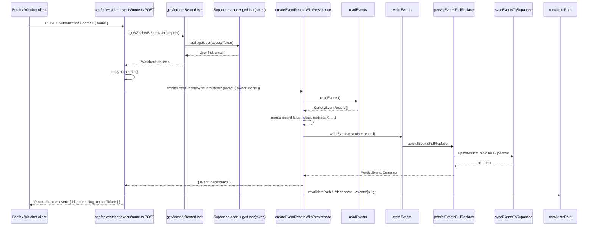

# Investigação — `POST /api/watcher/events` vs `POST /api/events`

**Repositório:** `event-media-gallery-1.0`  
**Escopo:** somente diagnóstico — sem correção de regra de negócio.  
**Contexto:** Dashboard cria eventos; Booth (via watcher) falha após correção de `view_count` / `download_count` / `share_count`.

---

## Resumo executivo

| Aspecto | Dashboard `/api/events` | Watcher `/api/watcher/events` |
|---------|-------------------------|-------------------------------|
| Persistência | `createEventRecordWithPersistence(name, { ownerUserId })` | **Idêntica** |
| Transformação de payload | `name.trim()` | **Idêntica** |
| `ownerUserId` | `userOrRes.id` | **Mesmo campo, origem de auth diferente** |
| Auth | Cookie SSR (`getRouteHandlerUser`) | Bearer JWT (`getWatcherBearerUser`) |
| Logs pré-persistência | `[EVENT_CREATE]` | **Ausente** (adicionado `[WATCHER_CREATE_EVENT]` temporário) |
| Resposta sucesso | `{ ok, event, persistence }` | `{ success, event: subset }` |
| Resposta erro 500 | `error` + `errorDetail` + `errorStack` | `error` genérico + `errorDetail` (+ `errorStack` nos logs temporários) |

**Conclusão de código:** não há ramificação de negócio exclusiva do watcher **antes** de `createEventRecordWithPersistence`. A divergência está em **(A) resolução de usuário** e **(B) observabilidade / formato de resposta**. Se o dashboard persiste com sucesso e o watcher falha no **mesmo deploy**, a falha ocorre **dentro da cadeia compartilhada** (`createEventRecordWithPersistence` → `writeEvents` → `persistEventsFullReplace` → `syncEventsToSupabase`) ou **após** persistência (`revalidatePath`), com parâmetros que devem ser comparados via logs (`ownerUserId`, `persistence.branch`).

---

## 1. Fluxo completo — `POST /api/watcher/events`



### Passo a passo (arquivo por arquivo)

| # | Etapa | Arquivo / função |
|---|--------|------------------|
| 1 | Entrada HTTP | `app/api/watcher/events/route.ts` → `POST(request)` |
| 2 | Autenticação Bearer | `lib/watcher/auth.ts` → `getWatcherBearerUser(request)` |
| 2a | Extrai token | `extractBearerToken` → header `Authorization: Bearer …` |
| 2b | Cliente Supabase | `createWatcherSupabaseClient()` — anon key, sem cookies |
| 2c | Valida JWT | `supabase.auth.getUser(accessToken)` |
| 2d | Suspensão | `isUserSuspended(user.id)` |
| 3 | Parse body | `request.json()` → `{ name?: string }` |
| 4 | Validação | `name.trim()` — vazio → **400** |
| 5 | Persistência | `services/eventService.ts` → `createEventRecordWithPersistence` |
| 5a | Leitura | `readEvents()` → `listPersistedEventsHydrated()` |
| 5b | Montagem | `generateEventId`, `slugify`, `generateUniqueUploadToken`, defaults cabine/métricas |
| 5c | Escrita | `writeEvents([...existentes, record])` |
| 5d | Repo | `repositories/eventRepository.ts` → `persistEventsFullReplace` |
| 5e | Sync DB | `syncEventsToSupabase` — select ids, delete stale, **upsert all rows** |
| 6 | Cache Next | `revalidatePath` × 3 |
| 7 | Resposta | JSON `{ success: true, event: { id, name, slug, uploadToken } }` |

---

## 2. Funções chamadas internamente (POST watcher)

```
POST (route.ts)
├── getWatcherBearerUser(request)
│   ├── extractBearerToken
│   ├── createWatcherSupabaseClient
│   ├── supabase.auth.getUser(accessToken)
│   └── isUserSuspended
├── request.json()
├── createEventRecordWithPersistence(name, { ownerUserId })
│   ├── readEvents()
│   │   └── listPersistedEventsHydrated()  [tokenService]
│   ├── slugify / ensureUniqueSlug / generateEventId / generateUniqueUploadToken
│   ├── writeEvents(events)
│   │   └── persistEventsFullReplace(events)
│   │       ├── isSupabaseConfigured / createServiceRoleSupabaseResult
│   │       ├── syncEventsToSupabase(client, events)
│   │       │   ├── select id from events
│   │       │   ├── delete stale ids
│   │       │   └── upsert(rows)  ← eventToRow() inclui view/download/share_count
│   │       └── [opcional] writeEventsToStorage (fallback JSON)
│   └── return { event, persistence }
├── revalidatePath (×3)
└── Response.json
```

---

## 3. Diff linha a linha — `events/route.ts` vs `watcher/events/route.ts`

| # | Dashboard `app/api/events/route.ts` | Watcher `app/api/watcher/events/route.ts` |
|---|-------------------------------------|-------------------------------------------|
| 1 | `getRouteHandlerUser()` — **sem** `request` | `getWatcherBearerUser(request)` — Bearer |
| 2 | Cliente: `createAuthServerSupabase()` + **cookies** | Cliente: `createWatcherSupabaseClient()` + **JWT** |
| 3 | `getUser()` sem argumento (sessão cookie) | `getUser(accessToken)` |
| 4 | Erro auth: `{ error: "…" }` | Erro auth: `{ ok: false, error: "…" }` |
| 5 | Body type `{ name?: string }` | Body type `CreateBody { name?: string }` — **equivalente** |
| 6 | `name = body.name.trim()` | **Idêntico** |
| 7 | Log `[EVENT_CREATE] POST recebido` | **Não tinha** (agora `[WATCHER_CREATE_EVENT]`) |
| 8 | `createEventRecordWithPersistence(name, { ownerUserId: userOrRes.id })` | **Chamada idêntica** |
| 9 | Desestrutura `{ event, persistence }` | Desestrutura só `{ event }` — **descarta `persistence` na resposta** |
| 10 | Log sucesso com `persistence.branch` | **Não tinha** (agora log temporário) |
| 11 | `revalidatePath` × 3 — **mesmos paths** | **Idêntico** |
| 12 | Sucesso: `{ ok: true, event, persistence }` — evento **completo** | `{ success: true, event: { id, name, slug, uploadToken } }` — **subset** |
| 13 | Erro: `error`, `errorDetail`, `errorStack` | Erro: `error` fixo "Erro interno…", `errorDetail`, (+ `errorStack` em log/resposta temporária) |
| 14 | Prefixo log erro: `[EVENT_CREATE]` | Prefixo: `[WATCHER_EVENTS]` + `[WATCHER_CREATE_EVENT]` |

**Watcher exclusivo:** método `GET` na mesma route (listagem Booth) — não afeta POST.

---

## 4. Confirmação — `createEventRecordWithPersistence`

**Sim — ambos chamam exatamente a mesma função com a mesma assinatura:**

```typescript
// Dashboard — app/api/events/route.ts:29-32
await createEventRecordWithPersistence(name, { ownerUserId: userOrRes.id });

// Watcher — app/api/watcher/events/route.ts:65-67 (antes dos logs)
await createEventRecordWithPersistence(name, { ownerUserId: userOrRes.id });
```

Implementação única em `services/eventService.ts:69-120`:

- Lê todos os eventos
- Cria `GalleryEventRecord` com defaults (incl. `viewCount: 0`, `downloadCount: 0`, `shareCount: 0`)
- `events.push(record)`
- `writeEvents(events)` → full replace no Supabase

**Não existe** `createEventRecordWithPersistenceWatcher` ou wrapper alternativo.

---

## 5. Transformações de payload — somente no watcher?

| Transformação | Watcher | Dashboard |
|---------------|---------|-----------|
| `body.name` → string trim | Sim | Sim |
| Renomear campos | **Não** | **Não** |
| Adicionar `ownerUserId` no body | **Não** — vem do auth | **Não** — vem do auth |
| Filtrar campos na resposta | Sim — só `id, name, slug, uploadToken` | Retorna `event` completo + `persistence` |

**Nenhuma transformação de payload de entrada exclusiva do watcher** além do mesmo `trim` no `name`.

---

## 6. Try/catch que mascaram o erro real

### Watcher `POST` (linhas 47-100)

```typescript
try {
  // … fluxo …
} catch (error) {
  console.error("[WATCHER_EVENTS] erro ao criar evento", { message, stack, error });
  return Response.json({
    success: false,
    error: "Erro interno ao criar evento.",  // ← mensagem genérica fixa
    errorDetail: message,                     // ← mensagem real (se deploy atual)
  }, { status: 500 });
}
```

| Mascaramento | Efeito |
|--------------|--------|
| `error: "Erro interno ao criar evento."` | Cliente Booth vê texto genérico + `errorDetail` |
| Sem log de `persistence` antes do catch | Não dá para saber se falhou em read/upsert/revalidate sem Vercel logs |
| `getWatcherBearerUser` retorna `Response` early | **Não** entra no catch — status 401/403/503 com corpo próprio |

### Dashboard `POST`

```typescript
catch {
  return Response.json({
    error: "Nao foi possivel criar o evento.",
    errorDetail: message,
    errorStack: stack ?? null,   // ← expõe stack no JSON
  }, { status: 500 });
}
```

| Diferença | Impacto diagnóstico |
|-----------|---------------------|
| Dashboard inclui `errorStack` no JSON | Mais fácil depurar no browser |
| Watcher omitia `errorStack` na resposta | Booth só via `errorDetail` ou logs servidor |
| Mensagens `error` diferentes | Ambos genéricos; detalhe está em `errorDetail` |

### Early return que **não** mascaram persistência

```typescript
if (userOrRes instanceof Response) return userOrRes;  // 401/403/503
if (!name) return Response.json(..., { status: 400 });
```

---

## 7. Logs temporários adicionados — `[WATCHER_CREATE_EVENT]`

Arquivo alterado: `app/api/watcher/events/route.ts` (somente observabilidade).

| Log | Quando | Campos |
|-----|--------|--------|
| `[WATCHER_CREATE_EVENT] auth rejeitada` | Bearer inválido | `status` |
| `[WATCHER_CREATE_EVENT] body recebido` | Após parse | `rawBody`, `nameTrimmed`, `nameLength` |
| `[WATCHER_CREATE_EVENT] ownerUserId resolvido` | Após auth | `ownerUserId`, `ownerUserIdTail`, `email` |
| `[WATCHER_CREATE_EVENT] chamando createEventRecordWithPersistence` | Antes persist | `name`, `options` |
| `[WATCHER_CREATE_EVENT] retorno createEventRecordWithPersistence` | Após persist | `eventId`, `slug`, `ownerUserId`, `persistenceBranch`, `repositoryLabel`, `supabaseError`, … |
| `[WATCHER_CREATE_EVENT] sucesso — revalidatePath concluído` | Antes 200 | `eventId`, `slug` |
| `[WATCHER_CREATE_EVENT] erro completo` | catch | `message`, `stack`, `serialized` |

### Como correlacionar com dashboard

No mesmo instante de um teste:

1. Criar evento no **dashboard** → Vercel log `[EVENT_CREATE] sucesso` → anotar `ownerUserIdTail`, `persistenceBranch`.
2. Criar evento no **Booth** → Vercel log `[WATCHER_CREATE_EVENT]` → comparar `ownerUserIdTail` e `persistenceBranch`.

Se `ownerUserId` **diferente** → mesma pessoa com duas identidades Supabase (improvável) ou contas distintas.

Se `ownerUserId` **igual** e watcher falha no log **antes** de `retorno createEventRecordWithPersistence` → falha na persistência compartilhada (deveria falhar dashboard também no mesmo momento).

Se log mostra **retorno OK** mas depois `erro completo` → falha em `revalidatePath` (pós-persistência).

---

## 8. Onde o fluxo watcher **pode** divergir do dashboard (hipóteses ordenadas)

### H1 — Mesmo código de persistência, parâmetros diferentes

Única variável de entrada para `createEventRecordWithPersistence`:

```typescript
{ ownerUserId: userOrRes.id }
```

- Dashboard: `user.id` de cookie SSR  
- Watcher: `user.id` de `getUser(accessToken)`  

**Verificar nos logs:** `ownerUserIdTail` em `[EVENT_CREATE]` vs `[WATCHER_CREATE_EVENT]`.

### H2 — Falha pós-persistência (`revalidatePath`)

Ambos chamam `revalidatePath` após sucesso. Se persistência OK e `revalidatePath` lança exceção:

- Cliente recebe **500**
- Evento **pode** já estar gravado no Supabase

**Verificar:** após erro no Booth, listar eventos (GET watcher ou dashboard) — evento novo aparece?

### H3 — Full-replace concorrente

`persistEventsFullReplace` reescreve **todos** os eventos. Duas criações simultâneas podem causar condição de corrida (último write ganha). Não explica falha **sistemática** só no watcher.

### H4 — Deploy / rota desatualizada

Se produção servir builds diferentes (improvável no mesmo app Next), rotas divergiriam. Confirmar que deploy único inclui `eventService` com `viewCount/downloadCount/shareCount`.

### H5 — Resposta mal interpretada pelo Booth (descartada se HTTP 500)

Booth falha com mensagem do `error` do servidor → confirma **500 real**, não parsing de `{ success }`.

---

## 9. Tabela de respostas HTTP

| Cenário | Watcher status | Corpo |
|---------|----------------|-------|
| Sem Bearer | 401 | `{ ok: false, error: "Token de acesso ausente." }` |
| Supabase não config | 503 | `{ ok: false, error: "Autenticacao da Gallery nao configurada." }` |
| Token inválido | 401 | `{ ok: false, error: "Sessao invalida ou expirada." }` |
| Usuário suspenso | 403 | `{ ok: false, error: "Usuario suspenso." }` |
| Nome vazio | 400 | `{ success: false, error: "Informe um nome…" }` |
| Persistência / revalidate falha | 500 | `{ success: false, error: "Erro interno…", errorDetail, errorStack? }` |
| Sucesso | 200 | `{ success: true, event: { id, name, slug, uploadToken } }` |

---

## 10. Próximos passos (diagnóstico — sem correção)

1. **Deploy** Gallery com logs `[WATCHER_CREATE_EVENT]`.
2. Reproduzir falha no Booth; abrir **Vercel → Logs** filtrando `WATCHER_CREATE_EVENT`.
3. No mesmo período, criar evento no dashboard; comparar `ownerUserIdTail` e `persistenceBranch`.
4. Se `erro completo` ocorrer **após** log de retorno OK → investigar `revalidatePath`.
5. Se erro ocorrer **durante** `createEventRecordWithPersistence` → comparar `errorDetail` / `supabaseError` com dashboard (mesma mensagem Supabase).

---

## 11. Arquivos de referência

| Papel | Caminho |
|-------|---------|
| Watcher route | `app/api/watcher/events/route.ts` |
| Dashboard route | `app/api/events/route.ts` |
| Auth Bearer | `lib/watcher/auth.ts` |
| Auth cookie | `lib/auth/session.ts` |
| Persistência | `services/eventService.ts` |
| Repo Supabase | `repositories/eventRepository.ts` (`eventToRow`, `syncEventsToSupabase`) |
| Cliente Booth | `Midiaup-Booth/src/auth/AuthClient.ts` → `createGalleryEvent` |

---

## 12. Alterações feitas nesta investigação

| Arquivo | Mudança | Tipo |
|---------|---------|------|
| `app/api/watcher/events/route.ts` | Logs `[WATCHER_CREATE_EVENT]` | Diagnóstico temporário |
| `app/api/watcher/events/route.ts` | `errorStack` no JSON 500 | Diagnóstico (alinha com dashboard) |
| Regras de negócio | — | **Não alteradas** |
