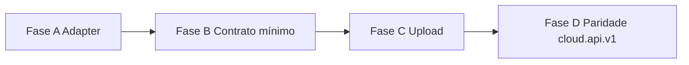

# Análise de integração — MidiaUp Booth ↔ event-media-gallery-1.0

**Data:** 2026-07-22  
**Escopo:** somente documentação e plano — **sem implementação**.  
**Fontes Gallery:** `PROJECT_CONTEXT.md`, `RELATORIO_TECNICO_HANDOFF.md`, `AGENTS.md`, `docs/*`, `app/api`, `services`, `repositories`, `types`.  
**Fonte Booth (contrato):** `Midiaup-Booth/specs/cloud-integration/` + ADR-020.

> Nota: o `README.md` raiz da Gallery ainda é template create-next-app. A fonte de verdade operacional é **`PROJECT_CONTEXT.md`** (mais atual que o relatório técnico histórico, que ainda descreve “sem auth” em partes).

---

## 1. Como um evento nasce hoje

Há **dois canais HTTP** que convergem no **mesmo** serviço de domínio:

| Canal | Rota | Auth | Quem usa |
|-------|------|------|----------|
| Dashboard | `POST /api/events` | Cookie sessão Supabase (`getRouteHandlerUser`) | Operador no browser `/dashboard` |
| Watcher / desktop | `POST /api/watcher/events` | `Authorization: Bearer <access_token>` (`getWatcherBearerUser`) | video-uploader / Booth futuro |

### Pipeline comum

```
name (string)
  → createEventRecordWithPersistence(name, { ownerUserId })
      → readEvents() (hidratados)
      → generateEventId()          // evt_<7 chars>
      → slugify(name) + ensureUniqueSlug
      → generateUniqueUploadToken
      → defaults (cabine, guest upload off, métricas 0, galleryLayout premium, …)
      → writeEvents → persistEventsFullReplace → syncEventsToSupabase
  → revalidatePath(/, /dashboard, /evento/{slug})
  → JSON de resposta
```

**Não existe** hoje no create:

- `startsOn` / data do evento
- `localEventId` do Booth (UUID Workspace)
- `clientName`, `profileId`, `boothInstallationId`
- `schemaVersion` / status Cloud (`draft|active|…`)

O **id remoto** que a Gallery devolve é `event.id` no formato `evt_xxxxxxx` — **não** é UUID v4.

---

## 2. Como o slug é criado

Implementação: `utils/slug.ts`.

1. `slugify(name)`  
   - NFD → remove diacríticos  
   - lowercase  
   - não `[a-z0-9]` → `-`  
   - trim hífens  
   - vazio → `"evento"`
2. `ensureUniqueSlug(base, taken)`  
   - se colidir: `base-2`, `base-3`, …

**Compatível em espírito** com o EventSlug do Booth (`normalizeEventSlug`), com diferenças:

| Aspecto | Gallery | Booth (Workspace) |
|---------|---------|-------------------|
| Max length | não truncado em 60 | max 60 |
| Unicidade | global na tabela/lista de eventos | por Workspace |
| Pasta FS | N/A (só slug URL) | `{date}-{slug}--{shortId}` |

O cliente **não** envia slug no create atual — a Gallery **sempre gera** a partir do `name`.

---

## 3. Como a “Gallery” (página pública) é criada

Não há entidade separada “Gallery”. Criar o **Evento** já habilita a experiência pública:

| Artefato | Origem |
|----------|--------|
| URL pública | `/evento/{slug}` → `routes.event(slug)` |
| URL absoluta | `buildPublicPageUrl` (`NEXT_PUBLIC_SITE_URL` ou `VERCEL_URL`) |
| UI | `app/(public)/evento/[slug]/page.tsx` + `VideoGallery` |
| Realtime | INSERT em `public.media` filtrado por evento |
| Config | flags no próprio `events` (layout, cabine, likes, guest upload…) |

Ou seja: **Evento Cloud = Evento Gallery**. Não há passo extra “criar gallery”.

---

## 4. Como o QR é gerado

Dois níveis:

### 4.1 QR do evento (galeria)

- UI dashboard: `components/dashboard/event-qr-*.tsx`
- Conteúdo do QR: `buildEventPublicUrl(slug)` → URL da galeria `/evento/{slug}`
- Geração: lib `qrcode` **no browser** (DataURL / canvas PNG para impressão)
- **Não** há API server dedicada “gerar QR do evento”; não persiste PNG do evento no R2 por padrão

### 4.2 QR da mídia

- Após upload guest complete (e caminhos similares): `lib/media/qr-code.ts`
- Texto: URL canônica `/media/{mediaId}` (`buildPublicPageUrl`)
- PNG via **QuickChart** (`quickchart.io/qr`) → store R2 `qrcodes/{mediaId}.png`
- Campo `media.qr_code` / `qrCode`

Para o Booth Share/QR de foto: o pipeline atual MidiaUp Booth usa Share próprio; a Gallery gera QR de **página pública da mídia**, não do Asset Workspace.

---

## 5. Como funciona o upload

Três caminhos distintos:

### A) Operador / Watcher (oficial)

1. Valida `POST /api/watcher/validate` `{ eventId, uploadToken }` (**sem** Bearer).
2. Upload de bytes para **R2** (fora deste repo — **video-uploader**).
3. INSERT linha em `media` (Supabase) — também no uploader.
4. Realtime atualiza `/evento/[slug]`.

Este app **não** expõe multipart do pipeline oficial do watcher.

### B) Guest upload (público)

1. Evento com `allowGuestUpload: true`.
2. `POST /api/events/[eventId]/guest-upload/sign` → URLs assinadas R2.
3. Browser PUT no R2.
4. `POST .../guest-upload/complete` → registro `media` + QR mídia (+ moderação se `requireGuestUploadApproval`).
5. Fallback multipart: `POST .../guest-upload` e, em dev sem R2, `public/guest-uploads/`.

### C) Cabine virtual (browser)

Usa o cliente guest-upload (`lib/guest-upload/upload-client.ts`) sobre o mesmo evento.

**Implicação Booth:** o Upload Engine do Booth (Workspace Assets + `UploadProvider`) é paralelo conceitual ao guest/watcher; a reutilização imediata mais natural para mídia de cabine é o fluxo **watcher** (token) ou um adapter que fale o mesmo contrato R2+media — **não** o `cloud.api.v1` de metadados sozinho.

---

## 6. APIs públicas / integração já existentes

### Autenticação / sessão (watcher)

| Método | Rota | Auth | Função |
|--------|------|------|--------|
| `POST` | `/api/watcher/session` | email+password | access + refresh tokens Supabase |
| `PATCH` | `/api/watcher/session` | refreshToken | renovar sessão |
| `POST` | `/api/watcher/validate` | eventId + uploadToken | validar binding upload |

### Eventos

| Método | Rota | Auth | Função |
|--------|------|------|--------|
| `POST` | `/api/events` | cookie user | create (dashboard) |
| `DELETE` | `/api/events/[eventId]` | ownership | delete cascata |
| `GET` | `/api/watcher/events` | Bearer | listar eventos do owner |
| `POST` | `/api/watcher/events` | Bearer | **criar evento** (name) |
| `GET`… | configs (`likes`, `live-moments`, `virtual-booth`, …) | dashboard | flags |
| `GET` | `/api/events/by-slug/[slug]/gallery-media` | público | mídias da galeria |
| `POST` | `/api/events/by-slug/[slug]/view` | público | métrica view |

### Mídia / engajamento

`PATCH/DELETE /api/media/[id]`, `download`, `like`, `view`, `track-*`, `public-delete`, `moderation-preview`, legado `DELETE /api/videos/[id]`.

### Guest upload

`sign`, `complete`, `guest-upload`, serve local `guest-uploads/...`.

### Admin

`POST /api/admin/users/create` (master_admin).

---

## 7. O que o Booth pode reutilizar **imediatamente**

Sem mudar a Gallery (apenas cliente Http Provider / EventSync adaptado):

| Capacidade | API Gallery | Uso Booth |
|------------|-------------|-----------|
| Login / refresh | `POST/PATCH /api/watcher/session` | Equivalente prático a auth “JWT + refresh” (C2 parcial) — **user/password**, não apiKey de instalação |
| Criar Evento Cloud | `POST /api/watcher/events` `{ name }` | Criar remoto; obter `id`, `slug`, `uploadToken` |
| Listar eventos remotos | `GET /api/watcher/events` | Diagnóstico / UI Setup futura |
| Validar upload | `POST /api/watcher/validate` | Antes de enviar Assets (épico Upload Cloud) |
| URL pública galeria | `https://{site}/evento/{slug}` | Mapear para `gallery.galleryUrl` |
| Token de upload | `uploadToken` na response create | Persistir no Workspace (campo novo ou `gallery.*`) para UploadProvider |

**Não reutilizar “como está” sem adaptação:**

- Envelope `/v1/events` do contrato Booth (paths e payloads diferentes)
- Campos `localEventId`, `startsOn`, `schemaVersion` na create (Gallery ignora / não aceita)
- Idempotência por `localEventId` (inexistente)
- `GET /v1/events/{uuid}` (id é `evt_…`; não há GET por id na API watcher documentada da mesma forma)
- PATCH de metadados Cloud (não há endpoint watcher de update de name/slug/startsOn)

---

## 8. Mudanças necessárias para o Booth criar Evento automaticamente

Plano em camadas (proposta — **não** implementado aqui).

### 8.1 Mínimo viável (Gallery quase intacta)

1. Booth `HttpMidiaUpEventProvider`:
   - Auth: `POST /api/watcher/session` (credenciais de conta MidiaUp do operador/instalação) **ou** tokens pré-provisionados.
   - Create: `POST /api/watcher/events` com `{ name }` (mapear `WorkspaceEvent.name`).
   - Mapear response → `gallery.remoteEventId = event.id`, `gallery.slug = event.slug`, `gallery.galleryUrl = buildEventPublicUrl(slug)`, guardar `uploadToken`.
2. Estender `WorkspaceEvent.gallery` (Booth) com `uploadToken` (hoje o contrato cloud-integration **não** menciona uploadToken — gap).
3. Offline: manter ADR-019 (`Pending`); ao `syncEvent`, chamar create watcher.
4. **Aceitar** que slug Cloud pode diferir do slug Booth (`-2` na Gallery) — espelhar `gallery.slug` da response (já previsto).

### 8.2 Alinhamento de contrato (Gallery + SPEC)

Para fechar `cloud.api.v1` de verdade:

| Mudança Gallery | Motivo |
|-----------------|--------|
| Aceitar body rico: `localEventId`, `slug` opcional, `startsOn`, `clientName`, `profileId` | Payload Booth |
| Idempotência: mesmo `localEventId` + owner → return existing | Retries offline |
| Response normalizada: `remoteEventId`, `galleryUrl`, `localEventId`, error envelope `{ error: { code } }` | ADR-020 |
| `GET /api/events/[id]` ou alias `/v1/events/{id}` | validateSync |
| Opcional: path alias `/v1/...` ou gateway | Versionamento |
| Auth instalação (apiKey/device) além de user JWT | C2 — se cabine não puder guardar senha de usuário |

### 8.3 Fora do create (épicos seguintes)

- Upload Assets Booth → R2 + INSERT media (reusar validate + contrato video-uploader ou nova rota).
- Auto-sync, conflitos, PATCH metadados.
- QR evento: Booth pode gerar localmente com `galleryUrl` (igual dashboard) sem API.

---

## 9. Compatibilidade com `specs/cloud-integration` (Booth)

### Já compatíveis (conceito)

| Tema contrato | Gallery hoje |
|---------------|--------------|
| Offline-first Booth | Sim — create remoto é opcional |
| UI não fala HTTP | Sim — via EventSyncService → Provider |
| local ≠ remote id | Sim — Workspace UUID vs `evt_*` |
| JWT + refresh | Sim — `/api/watcher/session` |
| Bearer em create | Sim — `/api/watcher/events` |
| Slug ASCII normalizado | Sim — `slugify` similar |
| galleryUrl pública | Sim — `/evento/{slug}` |
| Sync Pending → Synced | Mapeável após create OK |

### Precisam ajuste (contrato e/ou Gallery)

| Item cloud-integration | Gallery real | Ação proposta |
|------------------------|--------------|---------------|
| Path `/v1/events` | `/api/watcher/events` | Adapter no Provider **ou** alias na Gallery |
| `POST /v1/auth/token` + apiKey | `/api/watcher/session` email/password | Documentar grantType `password` / `refresh_token`; C2 |
| Body create com `localEventId`, `startsOn`, … | Só `{ name }` | Estender API **ou** relaxar contrato v1 “mínimo” |
| Response `remoteEventId` UUID | `id: evt_…` | Aceitar string opaca no contrato; renomear campo mentalmente |
| Idempotência localEventId | Ausente | Implementar na Gallery |
| Estados Uploading/Conflict HTTP | Códigos HTTP ad hoc (`success`/`ok`/`error`) | Unificar envelope erros |
| `GET` + `PATCH` evento | List/create watcher only | Adicionar ou marcar C* como bloqueantes |
| Header `X-MidiaUp-Api-Version` | Ausente | Opcional fase 2 |
| `uploadToken` | Essencial na Gallery | **Incluir no contrato Booth** (lacuna atual) |
| Status Cloud draft/active | Não no create response | C8 — defaults implícitos |
| Error codes `AUTH_*` / `EVENT_*` | Mensagens PT livres | Mapear no Provider |

### Open Questions reforçados pela análise

Além de C1–C16 do Booth:

| ID | Pergunta |
|----|----------|
| G1 | Conta Supabase da cabine: user dedicado por instalação vs apiKey nova? |
| G2 | Persistir `uploadToken` no `event.json` do Workspace — campo oficial? |
| G3 | video-uploader continua dono do INSERT media ou Booth fala direto com Gallery? |
| G4 | Aceitar `evt_*` como `remoteEventId` no contrato sem exigir UUID? |

---

## 10. Plano de integração (fases sugeridas)



### Fase A — Adapter (só Booth)

- `HttpMidiaUpEventProvider` contra APIs **atuais** watcher.
- Mapear create/list/session; sem mudar Gallery.
- Persistir `remoteEventId`, `slug`, `galleryUrl`, `uploadToken`, `Synced`.

### Fase B — Contrato mínimo na Gallery

- Create aceita `localEventId` + idempotência.
- Response alinhada (`remoteEventId` alias de `id`, `galleryUrl`).
- Error envelope estável.

### Fase C — Upload de Assets

- Booth UploadProvider → validate + R2 + media (com video-uploader ou API nova).

### Fase D — Paridade `cloud.api.v1`

- GET/PATCH, version headers, auth instalação se necessário, conflitos.

---

## 11. Resumo executivo

A Gallery **já é** o MidiaUp Cloud de eventos públicos: create autenticado via Bearer, slug automático, URL `/evento/{slug}`, QR de evento no dashboard, upload operacional via `uploadToken` + R2 (uploader irmão), guest upload separado.

O contrato `cloud.api.v1` do Booth está **conceitualmente alinhado**, mas **não é drop-in** com as rotas/payloads atuais. O caminho mais rápido é um **Provider adaptador** sobre `/api/watcher/*`, depois evoluir a Gallery para idempotência `localEventId` e envelope de resposta — sem bloquear a cabine offline.

**Nenhuma funcionalidade foi implementada neste documento.**
